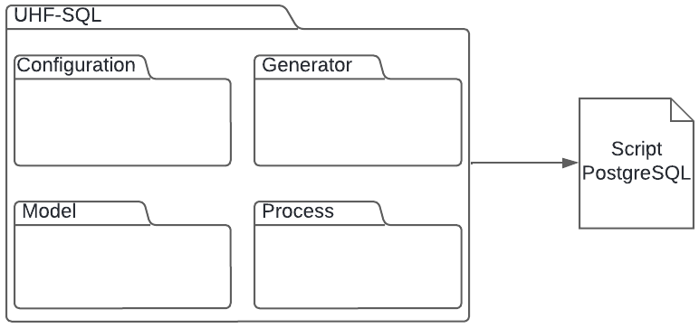
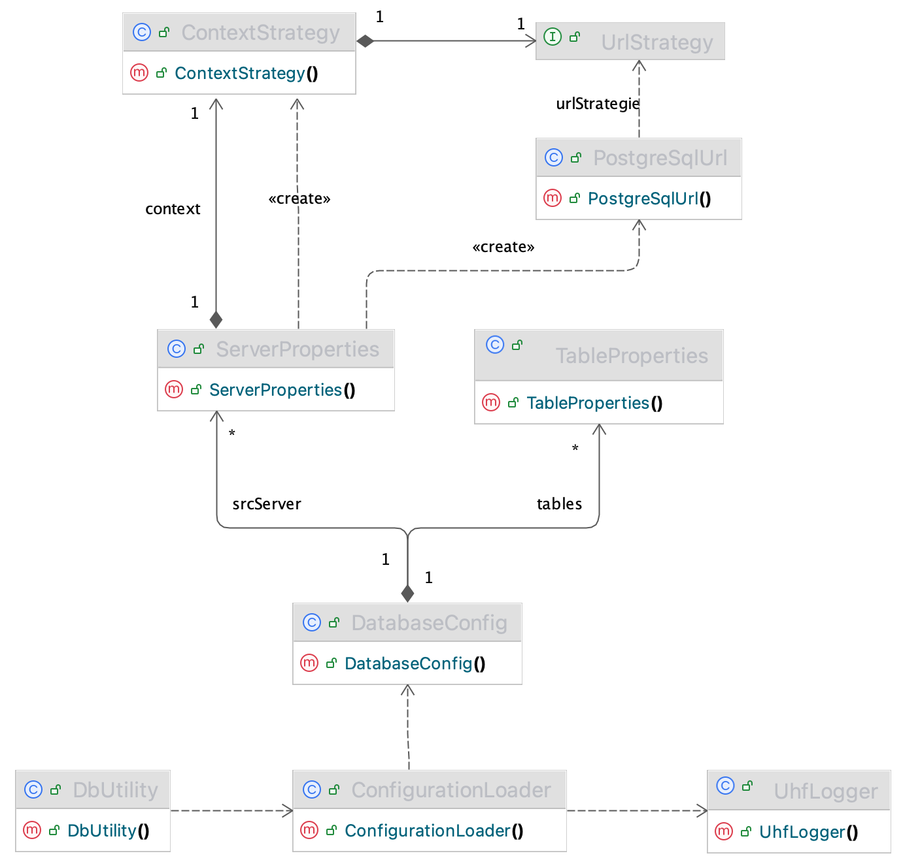
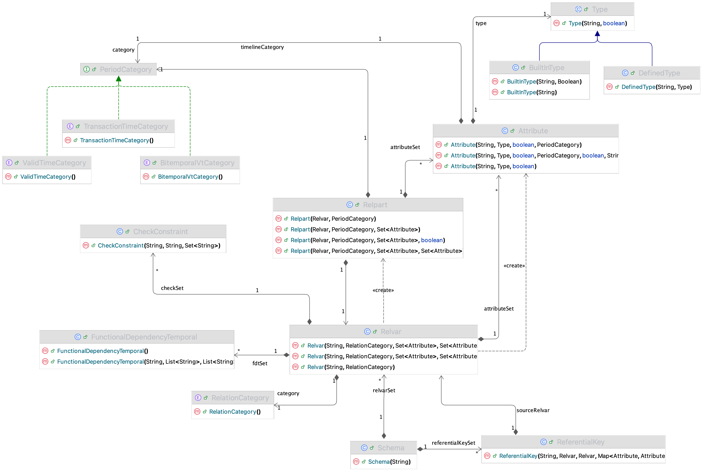
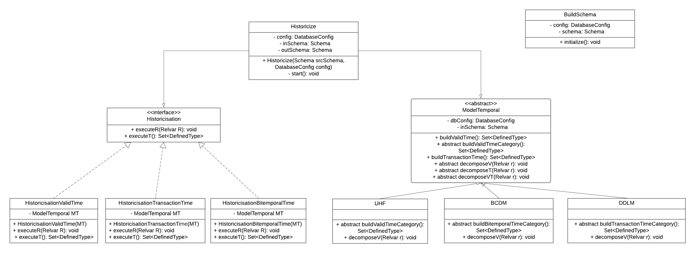
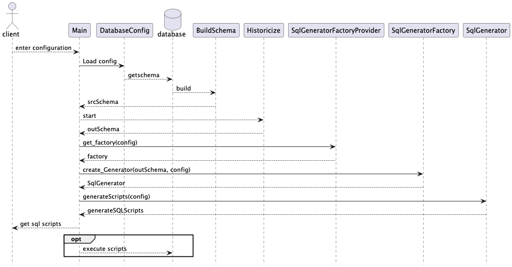
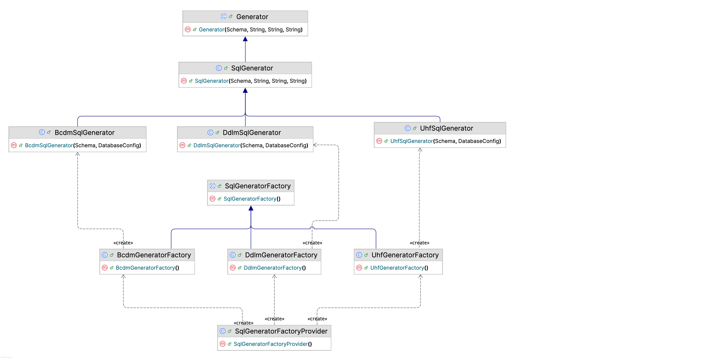
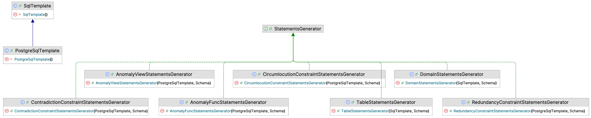

= {produit} Design Specification
Christina Khnaisser <Christina.Khnaisser@usherbrooke.ca>
Zeineb Zaiet <Zeineb.Zaiet@usherbrooke.ca>
:projet: Voyage
:produit: UHF-SQL
:toc:
:toc-title: Tables des matières
:sectnums:

== Introduction

This document describes the design of the product {produit} developed within the framework of the UHF project. Its main objective is to present and justify the necessary and sufficient modeling required to historicize a relational schema.

This document serves as the sole applicable functional reference upon which the product's architecture and design will be established. It is intended for the project owner, the project manager, the quality assurance group, the testing managers, and all members of the development team.

== Architecture

The {produit} program is divided into four modules: configuration, generator, model, and process.

===  Configuration Module

The configuration module groups all the classes needed to retrieve connection information and historicization parameters.

=== Model Module

The model module groups all the classes needed to represent a relational schema. This includes relation variables (relvar), attributes, defined types, key constraints, referential constraints, and temporal partitions (relpart).

=== Process Module

The process module groups all the classes needed to implement the schema construction algorithms from a database and the historicization algorithms.

=== Generator Module

The generator module groups all the classes needed to generate SQL statements executable on a DBMS. This includes code templates, their corresponding classes, and the generators.

== Configuration Module

The configuration module manages the connection parameters to the database to be historicized, as well as the historicization parameters. It is in YAML format and contains the following parameters:

.Connection parameters to the database schema to be historicized
----
 srcServer:
    - rdbms: postgresql
    - host: localhost
    - port: 5432
    - rdbmsPath: /Applications/Postgres.app/Contents/Versions/17/bin/psql
    - databaseId: uhf
    - schemaId: supply
    - user: uhf
    - pass: uhf
----

* `rdbms` : The relational database management system in use.
* `host` : Address of the server hosting the database.
* `port` : Access port of the DBMS.
* `rdbmsPath` : Path to the DBMS client executable.
* `databaseId` : Name of the database to connect to.
* `schemaId` : Name of the database schema to be historicized.
* `user` : Username used to connect to the database.
* `pass` : Password associated with the user.

.Historicisation parameters
----
temporalModel: UHF # (BCDM, DDLM, UHF)
schemaTemporalCategory: V # (V, T, VT)
author: Zeineb Zaiet
outDirPath: demo/Supplier-Part/res
version: 1.0
includeVxx: false
executeScript: true
useMode: virtual # (virtual, physical, both)
----

* `temporalModel` : The temporal model selected: UHF, DDLM, or BCDM.
* `schemaTemporalCategory` : The desired temporal category: valid time (V), transaction time (T) ou bitemporal (VT).
* `author` : Name of the author responsible for the generated schema.
* `outDirPath` : Name of the directory in which the SQL files of the historicized schema are created.
* `version`: Version of the generated historicized schema.
* `includeVxx` : Whether or not to include the Vxx temporal partition (indeterminate period).
* `executeScript` : Whether or not to execute the generated SQL files on the target DBMS.
* `useMode` : Usage mode of the generated schema :
   - `physical` : creates a schema with populated tables ;
   - `virtual` : creates a schema with views generated from temporal functional dependencies ;
   - `both` : jointly generates both _physical_ and _virtual_ modes.

=== Class diagram
The Strategy pattern is used for connection handling, allowing different
RDBMS connection strategies to be plugged in.

== Model module

The model module contains the main class `Schema`.

`Schema` represents a relational schema composed of relation variables (`Relvar`) and their temporal partitions  (`Relpart`), referential constraints (`ReferentialKey`), defined types and predefined types and temporal functional dependencies.

A functional dependency is a constraint between two sets of attributes, a determining set and a dependent set. For a relation R(X,Y,Z) where X, Y and Z are subsets of the set of attributes, a functional dependency (FD) from X to Y, denoted X → Y, is said to exist if each value of X corresponds to at most one value of Y (i.e., zero or one).
A temporal functional dependency (TFD) is an FD with the addition of one or more temporal attributes to the determining set.

=== Class diagram

== Process Module
The Strategy pattern is used for the historicization process, where the selected temporal model and temporal category determine which temporal categories are applied and how relparts are generated.

=== Class diagram

=== Sequence diagram
The execution starts by loading the configuration file, the tool loads the connection and historization parameters using the DatabaseConfig class.
The existing database structure is then parsed and built into a relational model structure (BuildSchema), which is passed to the Historicize class that normalizes
the schema and construct the corresponding historicized schema. The temporal schema is then passed to the SQL generator corresponding to the selected
temporal model, which produces the SQL scripts. Finally, if executeScript = true, the generated scripts are executed against the target database.

=== Non-historicized schema construction

The construction of the non-historicized schema consists of instantiating the model classes from the existing elements in a database. The construction uses the _SchemaCrawler_ library for connection and information retrieval.
Tables are represented by relation variables (relvar).

=== Construction of the historicized schema

The construction of a historicized schema is factored into several classes.
The classes implement the historicization algorithms according to the temporal category:

* `HistoricisationValidTime` : historicization for a valid-time unitemporal schema.
* `HistoricisationTransactionTime` : historicization for a transaction-time unitemporal schema.
* `HistoricisationBitemporalTime` : historicization for a bitemporal schema.

Each class implements the following methods from the `Historicisation` interface:

* `executeT()` : builds the temporal defined types (interval or point) for the target temporal category.
* `executeR(Relvar r)` : decomposes a relation variable into partitions according to the target temporal category.

The temporal model-specific classes `Uhf`, `Bcdm` and `Ddlm` implement the decomposition algorithms specific to each temporal model:

* `decomposeV(Relvar r)` : decomposes a relation variable according to the valid-time category.
* `decomposeT(Relvar r)` : decomposes a relation variable according to the transaction-time category.
* `decomposeVT(Relvar r)` : decomposes a relation variable according to the bitemporal category.
* `buildValidTime()` : builds the valid-time temporal types.
* `buildTransactionTime()` : builds the transaction-time temporal types.
* `buildBitemporalTime()` : builds the bitemporal temporal types.

`Historicize` is the class that manages the historicization process, selecting the appropriate temporal model and category based on the configuration.

== Generator Module

The code generation module uses the StringTemplate library.
Each SQL statement is defined as a template in a .stg file. For each template, a Java method is developed to instantiate the template with the specified arguments. The generators then orchestrate the creation of the SQL scripts according to the target model and DBMS.

=== Class diagram
The Factory Method pattern is used for SQL script generation, where a provider
selects and instantiates the appropriate generator factory at runtime, based on
the configured temporal model.

=== SQL Templates
The `SSQL.stg` file groups the templates common to multiple DBMS. The `SqlTemplate` class implements the `SSQL.stg` file.

The `PostgreSQL.stg` file groups the templates compatible with PostgreSQL. The `PostgreSqlTemplate` class implements the `PostgreSQL.stg` file.

=== SQL Generators
The `SqlGenerator` class is responsible for generating SQL files common to multiple DBMS. It contains the methods that call the templates from `SqlTemplate`.

The `UhfSqlGenerator` class generates the SQL files for the historicized schema according to the UHF temporal model.
The `BcdmSqlGenerator` class generates the SQL files for the historicized schema according to the BCDM temporal model.
The `DdlmSqlGenerator` class generates the SQL files for the historicized schema according to the DDLM temporal model.