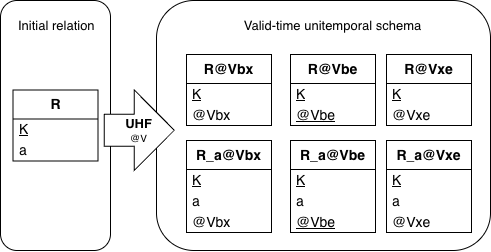
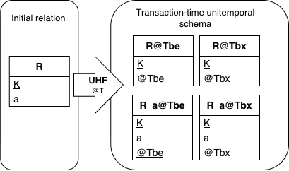
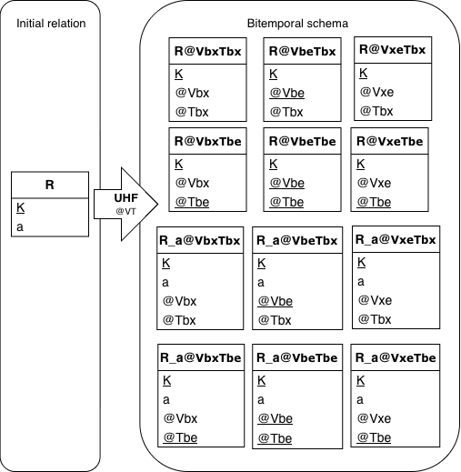
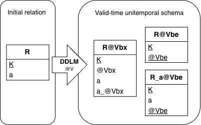
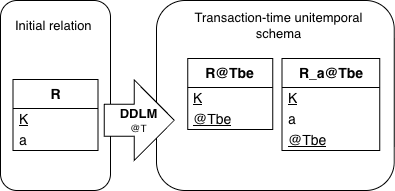
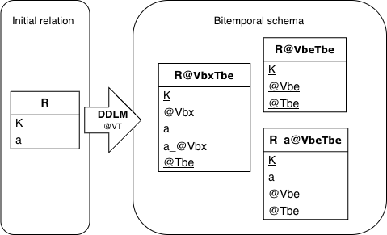
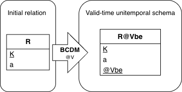
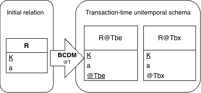
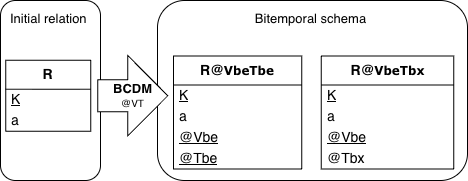

= Relpart Decomposition Algorithms in {produit}
Christina Khnaisser <Christina.Khnaisser@usherbrooke.ca>
Zeineb Zaiet <Zeineb.Zaiet@usherbrooke.ca>
:projet: Voyage
:produit: UHF-SQL
:toc:
:toc-title: Tables des matières
:sectnums:
:stem: latexmath

Let stem:[R] be a relation composed of one key attribute denoted stem:[k]
and one non-key attribute denoted stem:[a]. More generally, let stem:[n] be the total number of non-key attributes
in a relation.

== UHF

The algorithm generates a historicized schema in 6NF, where the key induces the creation of a key partition and each attribute induces an attribute partition.

=== Valid-time unitemporal schema

.Naming of valid-time unitemporal partitions.
|===
|Category | Alias type:domain   | Relpart identifier
| Vbx      | since:Vbx_POINT      | <id_relvar>_since
| Vbe      | during:Vbe_INTERVAL  | <id_relvar>_during
| Vxe      | until:Vxe_POINT      | <id_relvar>_until
|===

*General formula:* stem:[R] is partitioned into stem:[3 + 3 × n] relparts
(where stem:[n] represents the number of non-key attributes):

* *3 partitions:* stem:[R@Vbx], stem:[R@Vbe] and stem:[R@Vxe],
each containing a corresponding valid-time attribute.
* stem:[n] partitions R_a~i~\_@Vbx, stem:[n] partitions R_a~i~_@Vbe and stem:[n] partitions R_a~i~_@Vxe. Each partition contains the key attributes
of stem:[R], the attribute a~i~, and a valid-time attribute
corresponding to a~i~.

The following figure illustrates an example of the valid-time unitemporalization
of a relation according to the UHF model.

[#figuhfV-relparts]
.Relparts according to the valid-time category.

=== Transaction-time unitemporal schema

.Naming of transaction-time unitemporal partitions.
|===
|Category | Alias type:domain     | Relpart identifier
| Tbx      | created:Tbx_POINT      | <id_relvar>_created
| Tbe      | lifespan:Tbe_INTERVAL  | <id_relvar>_lifespan
|===

*General formula:* stem:[R] is partitioned into stem:[2 + 2 × n] relparts
(where stem:[n] represents the number of non-key attributes):

* *2 partitions:* stem:[R@Tbe] and stem:[R@Tbx],
each containing a corresponding valid-time attribute.
* 2 partitions R_a~i~\_@Tbe and R_a~i~_@Tbx for each non-key attribute
a~i~, each containing the key attributes of stem:[R], the attribute
a~i~, and a transaction-time temporal attribute for a~i~.

The following figure illustrates an example of the transaction-time
unitemporalization of a relation according to the UHF model.

.Relparts according to the transaction-time category.

=== Bitemporal schema
*General formula:* stem:[R] is partitioned into stem:[6 + 6 × n] relparts
(where stem:[n] represents the number of non-key attributes):

* *6 partitions:* stem:[R@VbxTbx], stem:[R@VbxTbe], stem:[R@VbeTbx], stem:[R@VbeTbe],
stem:[R@VxeTbx] and stem:[R@VxeTbe], each
containing the key attributes of stem:[R], a valid-time temporal attribute,
and a transaction-time temporal attribute.

* *stem:[n] partitions:* R_a~i~\_@VbxTbx, stem:[n] partitions R_a~i~_@VbxTbe,
stem:[n] partitions R_a~i~\_@VbeTbx, stem:[n] partitions R_a~i~_@VbeTbe,
stem:[n] partitions R_a~i~\_@VxeTbx and stem:[n] partitions R_a~i~_@VxeTbe, each containing the key attributes of
stem:[R], the attribute a~i~, a valid-time temporal attribute, and a
transaction-time temporal attribute.

The following figure illustrates an example of the bitemporalization of a
relation according to the UHF model.

.Relparts according to the bitemporal category.

== DDLM

=== Valid-time unitemporal schema

The algorithm generates a historicized schema where the key and each attribute induce a partition in 6NF for the @Vbe category.
For the @Vbx category, for each relvar (source relation) the algorithm generates a single partition in 5NF containing the key attributes,
a temporal attribute since for the key, and each non-key attribute a~i~ with its corresponding temporal attribute a~i~_since.

*General formula:* stem:[R] is partitioned into stem:[2 + n] relparts
(where stem:[n] represents the number of non-key attributes):

* One partition stem:[R@Vbx] containing all attributes of stem:[R], a valid-time
temporal attribute for each non-key attribute denoted a~i~_@Vbx, and a
valid-time temporal attribute for the key attributes denoted stem:[@Vbx].

* One partition stem:[R@Vbe] containing the key attributes of stem:[R] and a
valid-time temporal attribute stem:[@Vbe].

* stem:[n] partitions R_a~i~_@Vbe for each non-key attribute a~i~.

The following figure illustrates an example of the valid-time unitemporalization
of a relation according to the DDLM model.

.Relparts according to the valid-time category.

=== Transaction-time unitemporal schema

The algorithm generates a historicized schema in 6NF, where the key induces the creation of a key partition and each attribute induces an attribute partition.

*General formula:* stem:[R] is partitioned into stem:[n] relparts
(where stem:[n] represents the number of non-key attributes):

* One partition stem:[R@Tbe] containing the key attributes of stem:[R] and a
transaction-time temporal attribute stem:[@Tbe].
* stem:[n] partitions R_a~i~_@Tbe for each non-key attribute a~i~.

The following figure illustrates an example of the transaction-time
unitemporalization of a relation according to the DDLM model.

.Relparts according to the transaction-time category.

=== Bitemporal schema
The algorithm generates a historicized schema where the key and each attribute induce a partition in
6NF containing both @Vbe and @Tbe temporal attributes. For the @Vbx category,
for each relvar (source relation) the algorithm generates a single partition in 5NF
containing the key attributes, a temporal attribute since for the key,
each non-key attribute a~i~ with its corresponding temporal attribute a~i~_since,
and a @Tbe temporal attribute.

*General formula:* stem:[R] is partitioned into stem:[2 + n] relparts
(where stem:[n] represents the number of non-key attributes):

* One partition stem:[R@VbxTbe] containing all attributes of stem:[R], a valid-time
temporal attribute stem:[@Vbx] for each non-key attribute (R_a~i~_@Vbx), a valid-time temporal
attribute stem:[@Vbx] for the key attributes, and a transaction-time temporal
attribute stem:[@Tbe].

* One partition stem:[R@VbeTbe] containing the key attributes of stem:[R], a valid-time
temporal attribute stem:[@Vbe], and a transaction-time temporal attribute stem:[@Tbe].

* stem:[n] partitions R_a~i~_@VbeTbe, each containing the key attributes of
stem:[R], the attribute a~i~, a valid-time temporal attribute stem:[@Vbe],
and a transaction-time temporal attribute stem:[@Tbe].

The following figure illustrates an example of the bitemporalization of a
relation according to the DDLM model.

.Relparts according to the bitemporal category.

== BCDM

The algorithm generates a historicized schema by adding a single temporal attribute
(@Vbe, @Tbe, @Tbx, @VbeTbx or @VbeTbe) to each source relation depending on the target temporal category.

=== Valid-time unitemporal schema

*General formula:* stem:[R] is partitioned into *one* relpart stem:[R@Vbe]
containing all attributes of stem:[R], with the addition of a valid-time
temporal attribute denoted stem:[@Vbe].

The following figure illustrates an example of the valid-time unitemporalization
of a relation according to the BCDM model.

.Relparts according to the valid-time category.

=== Transaction-time unitemporal schema

*General formula:* stem:[R] is partitioned into 2 relparts:

* One partition stem:[R@Tbe] containing all attributes of stem:[R] and a
transaction-time temporal attribute stem:[@Tbe].

* One partition stem:[R@Tbx] containing all attributes of stem:[R] and a
transaction-time temporal attribute stem:[@Tbx].

The following figure illustrates an example of the transaction-time
unitemporalization of a relation according to the BCDM model.

.Relparts according to the transaction-time category.

=== Bitemporal schema

*General formula:* stem:[R] is partitioned into 2 relparts:

* One partition stem:[R@VbeTbe] containing all attributes of stem:[R], a valid-time
temporal attribute stem:[@Vbe], and a transaction-time temporal attribute stem:[@Tbe].

* One partition stem:[R@VbeTbx] containing all attributes of stem:[R], a valid-time
temporal attribute stem:[@Vbe], and a transaction-time temporal attribute stem:[@Tbx].

The following figure illustrates an example of the bitemporalization of a
relation according to the BCDM model.

.Relparts according to the bitemporal category.

